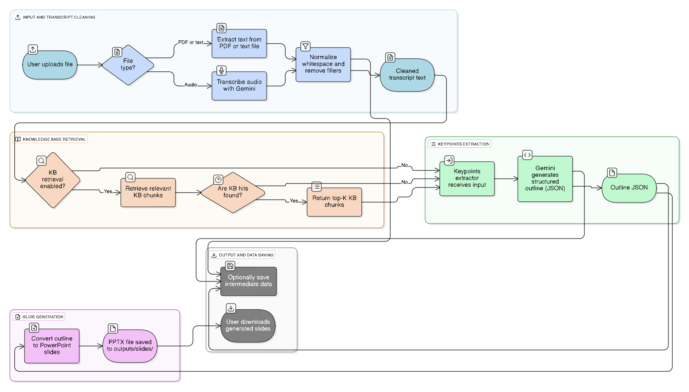

# Lecture Notes Processor – Multi‑Agent App (Gemini API)

> **IRWA Group Project – Y3S1 (Semester 2, 2025)**

## Group Members

| ID Number       | Name             |
|----------------|------------------|
| IT23178304      | ARIYARATHNA M.L  |
| IT23176942      | NAURUNNA L.A.D.P |
| IT23380950      | PERERA M.K.P.T.S |


## Project Overview
An **AI-powered app** that transforms lecture content into **clean transcripts**, **structured outlines**, and **professional slides**.  
Built with **Google Gemini 2.5 Flash** and **Streamlit**, it’s designed to help **university lecturers, professors, and students** prepare high-quality presentations and study material efficiently.  

---

## 🔹 What it Does
1. **Transcript Cleaner Agent** – accepts audio/video or raw text and produces a clean transcript (removes filler words, fixes punctuation).  
2. **Retriever Agent (KB)** – fetches relevant snippets from a pre-built **knowledge base** to improve accuracy (RAG).  
3. **Key Points Extractor Agent** – extracts a **hierarchical outline** (topics → sections → bullets) with optional timestamps, using structured JSON output.  
4. **Slide Generator Agent** – converts the outline into a polished **PowerPoint (`.pptx`)**.  

---

## 🔹 Agentic Flow
The system follows an **agentic architecture**:

- **Transcript Cleaner** → cleans lecture input  
- **Retriever** → adds domain knowledge context  
- **Key Points Extractor** → builds outline (structured JSON)  
- **Slide Generator** → produces PowerPoint slides  

📌 **System Diagram:**  
  

---

# Quickstart & Setup

## Prerequisites
1. **Install Python 3.12** and **FFmpeg** (for audio processing).
2. **Create an API key (free)** in [Google AI Studio](https://console.cloud.google.com/), and copy it into the `.env` file.

## Setup & Run

1. **Clone the Repository**
   ```bash
   git clone <your-repo-url>
   cd IT3041-IRWA
   ```

2. **Create a Virtual Environment** (Python 3.12)
   ```bash
   py -3.12 -m venv .venv
   ```

3. **Activate the Virtual Environment**
   * On **Windows**:
     ```bash
     .venv\Scripts\activate
     ```
   * On **macOS/Linux**:
     ```bash
     source .venv/bin/activate
     ```

4. **Upgrade pip** and **Install Dependencies**
   ```bash
   python -m pip install --upgrade pip
   pip install -r requirements.txt
   ```

5. **Run the Streamlit App**
   ```bash
   streamlit run app.py
   ```

6. **Upload a Lecture** (audio: `.mp3` or `.wav`, text/PDF transcript) and click **Run**.  
   After processing, download the generated **`.pptx`** presentation from the UI.

---

## 🔹 Responsible AI Alignment
- **Transparency** → Users are informed that uploads are processed only within the app, stored temporarily on the backend, and never shared externally.  
- **Privacy Protection** → Files are auto-deleted after processing; only used for generating outputs.  
- **Ethical Handling** → No hidden data collection, no resale to third parties.  
- **Fairness** → Works equally for all lecture materials, with no bias toward specific subjects.  

---

## 🔹 Commercialization Pitch
This system can be offered as an **AI assistant for educators and students**:

- **Target Users:**  
  - University **lecturers/professors** who prepare many presentations  
  - **Students** who need structured study notes and slides  

- **Value Proposition:**  
  - Saves time and effort in preparing content  
  - Produces professional-quality, consistent slides  
  - Enhances focus on **teaching and learning**  

- **Pricing Model:**  
  - **Freemium:** basic transcript-to-outline  
  - **Premium subscription:** unlimited uploads, advanced slide templates  
  - **Institutional license:** campus-wide access for staff and students  

---

## 🔹 Tech Stack
- **Frontend:** Streamlit  
- **Backend Agents:** Python (Transcript Cleaner, Retriever, Keypoint Extractor, Slide Generator)  
- **LLM:** Google **Gemini 2.5 Flash** (text, embeddings, multimodal transcription)  
- **Storage:** Local filesystem (replaceable with S3/Azure Blob for scale)  
- **Notebook:** `01_build_it_kb.ipynb` → builds Knowledge Base (KB) for domain-specific retrieval  

---
